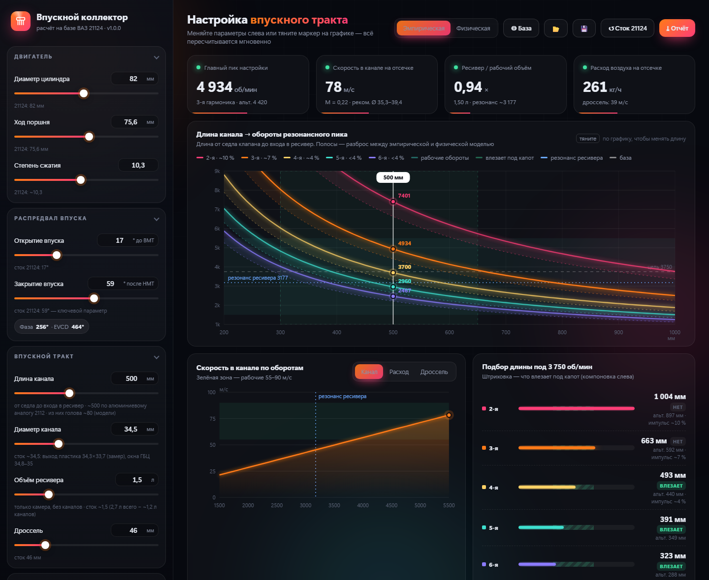

# Расчёт впускного коллектора на основе мотора ВАЗ 21124

Десктоп-программа для Windows, которая помогает спроектировать **впускной ресивер** (коллектор) атмосферного 4-тактного мотора. Значения по умолчанию собраны для **ВАЗ 21124 1.6 16V**, но все параметры меняются, так что подойдёт и другой мотор.



> ⚠️ Это **инженерная оценка** с погрешностью порядка ±10–15 %, а не газодинамическое моделирование. Программа помогает выбрать стартовую длину каналов и объём ресивера и сравнить варианты. Окончательно результат проверяется логами ЭБУ «до/после», стендом или 1D-моделированием. Подробно — в [методике](docs/METHODOLOGY.md).

## Что считает

| Что | Зачем | Как |
|---|---|---|
| **Настройка длины канала** | На каких оборотах отражённая волна давления «дозаряжает» цилиндр | Волновая настройка по гармоникам 2–6 ([методика, §2](docs/METHODOLOGY.md#2-волновая-настройка-длины-канала)) |
| **Подбор длины под обороты** | Какая длина нужна для пика на заданных оборотах и влезет ли она под капот | Обратная задача той же модели |
| **Резонанс ресивера** | Как объём ресивера и труба до фильтра сдвигают резонанс всего ресивера | Резонатор Гельмгольца с точными концевыми поправками ([§3](docs/METHODOLOGY.md#3-резонанс-ресивера-гельмгольц)) |
| **Скорость и число Маха в канале** | Не слишком ли широкий или узкий канал | Уравнение неразрывности ([§4](docs/METHODOLOGY.md#4-потоки)) |
| **Расход воздуха** | Сравнить с ДМРВ в логах | ṁ = ρ·Vd·N/120·VE |
| **Скорость в дросселе** | Не ограничивает ли дроссель | То же, через площадь дросселя |

## Возможности

- Все графики и значения пересчитываются мгновенно; длину канала можно менять, **перетаскивая маркер** на графике.
- **Две модели скорости звука**: эмпирическая (как в классических калькуляторах) и физическая. Полоса между ними на графике показывает неопределённость метода.
- **Режим сравнения** «◎ База»: запоминаете текущий вариант, меняете параметры и видите было/стало на графиках и в карточках.
- **Сохранение и загрузка конфигураций** в `.json`.
- **Отчёт** в `.txt` со всеми цифрами и выводами.
- **Консольный режим** без интерфейса — удобно для скриптов и перебора вариантов.

## Установка

### Готовый exe

Скачайте `VAZ21124-IntakeCalc.exe` со страницы [Releases](../../releases) и запустите. Установка не нужна. Требуется Windows 10/11 с Microsoft Edge WebView2; на Windows 11 он есть по умолчанию.

### Из исходников

```bash
git clone https://github.com/banan4ik30/vaz-21124-intake-calc.git
cd vaz-21124-intake-calc
python -m venv .venv
.venv\Scripts\pip install -r requirements.txt
.venv\Scripts\python app.py
```

### Консольный режим

```bash
python calc.py                                   # отчёт для стока 21124
python calc.py -s runner_len_mm=620 -s plenum_l=2.0
python calc.py -c my_config.json --json          # полный результат в JSON
python calc.py --defaults                        # список параметров
```

## Как пользоваться

1. Нажмите **«Сток 21124»**: подставятся исходные данные мотора (откуда они — [DATA_21124.md](docs/DATA_21124.md)).
2. Нажмите **«◎ База»**, чтобы запомнить сток.
3. Меняйте длину канала, объём ресивера, диаметр и смотрите:
   - **главный пик**: самая сильная гармоника в рабочем диапазоне;
   - **подбор длины**: какая длина даст пик на целевых оборотах и влезет ли она (штриховка — диапазон компоновки);
   - **выводы**: автоматический разбор конфигурации.
4. Сохраните удачный вариант в `.json` и выгрузите отчёт.

**Длина канала** — это полный путь **от седла клапана до входа в ресивер**: канал в ГБЦ + нижний коллектор + патрубок ресивера.

## Структура проекта

| Файл | За что отвечает |
|---|---|
| [`calc.py`](calc.py) | **Расчётное ядро.** Все формулы, константы и эмпирические пороги. Не зависит от интерфейса, работает и как консольная утилита |
| [`app.py`](app.py) | Оболочка окна (pywebview + Edge WebView2): мост между интерфейсом и `calc.py`, файлы, настройки |
| [`ui/index.html`](ui/index.html) | Интерфейс: поля, графики (SVG), анимации. Один файл без внешних зависимостей |
| [`dev_server.py`](dev_server.py) | Dev-сервер, чтобы править интерфейс в обычном браузере (`?dev=1`) |
| [`tests/test_calc.py`](tests/test_calc.py) | Автотесты расчётов по опорным значениям |
| [`docs/METHODOLOGY.md`](docs/METHODOLOGY.md) | Методика: формулы, вывод, ограничения, источники |
| [`docs/VALIDATION.md`](docs/VALIDATION.md) | Чем подтверждается правильность расчётов |
| [`docs/DATA_21124.md`](docs/DATA_21124.md) | Исходные данные мотора 21124 с источниками |
| [`build.ps1`](build.ps1) | Сборка exe через PyInstaller |
| [`make_icon.py`](make_icon.py) | Генерация иконки |
| `.github/workflows/` | CI: тесты на каждый push, сборка exe в релиз по тегу |

## Проверка

```bash
pip install -r requirements-dev.txt
python -m pytest -q
```

Тесты сверяют программу со справочными значениями, классической формулой волновой настройки, упрощённой формулой с DRIVE2 и независимым калькулятором Bowling. Подробно — в [VALIDATION.md](docs/VALIDATION.md).

## Сборка exe

```powershell
.\build.ps1
```

Результат — `dist\VAZ21124-IntakeCalc.exe`. Релиз со сборкой создаётся автоматически при пуше тега `v*`.

## Ограничения

- Одномерная модель: не учитывает изгибы, конусность, форму входа в канал, взаимное влияние цилиндров и выпуск.
- Сила гармоник — ориентировочная (по калькулятору Bowling).
- Пороги «норма/не норма» — эмпирические ориентиры практиков, а не законы физики ([методика, §6](docs/METHODOLOGY.md#6-эмпирические-ориентиры-не-законы-физики)).
- Исходные данные 21124 частично оценочные: у каждой цифры указана надёжность ([DATA_21124.md](docs/DATA_21124.md)).

## Лицензия

[MIT](LICENSE): можно свободно использовать, изменять и распространять, в том числе в коммерческих целях, с сохранением уведомления об авторстве. Программа предоставляется «как есть», без гарантий.
